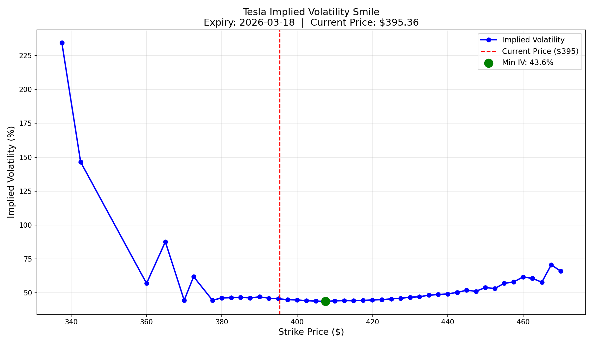

# Black-Scholes Options Pricing & Implied Volatility

## Overview
Python implementation of the Black-Scholes-Merton options pricing model, 
applied to real Tesla (TSLA) options data. Calculates theoretical option 
prices, derives implied volatility from live market prices, and plots the 
implied volatility smile across strike prices.

## What This Project Does
1. Implements the Black-Scholes formula from scratch to price European 
   call and put options
2. Verifies the model using put-call parity
3. Pulls live Tesla option chain data via the yfinance API
4. Back-solves for implied volatility using Brent's numerical method
5. Plots the implied volatility smile across strikes and analyses 
   the volatility skew

## Key Findings
- Tesla's current price: ~$395
- Minimum implied volatility of 43.6% occurs at the money (near $395)
- Strong left skew visible — deep out of the money puts carry 
  significantly higher IV (200%+) than at the money options
- This skew reflects the market pricing in far greater fear of a 
  sharp downside move than an equivalent upside rally
- The smile shape confirms Black-Scholes assumption of constant 
  volatility is violated in practice — real markets price tail 
  risk asymmetrically

## Volatility Smile


## The Black-Scholes Formula
```
C = S·N(d₁) - K·e^(-rT)·N(d₂)

d₁ = [ln(S/K) + (r + σ²/2)T] / σ√T
d₂ = d₁ - σ√T

Where:
S = current stock price
K = strike price  
T = time to expiry (years)
r = risk-free rate
σ = volatility
N() = cumulative normal distribution
```

## Implied Volatility
The model is inverted using Brent's method to back-solve for the 
volatility implied by each option's market price. Where implied 
volatility exceeds historical realised volatility, options are 
considered overpriced — a signal to sell options and collect premium.

## Libraries
- numpy
- matplotlib  
- yfinance
- scipy

## How to Run
```bash
pip install numpy matplotlib yfinance scipy
python black_scholes.py
```
