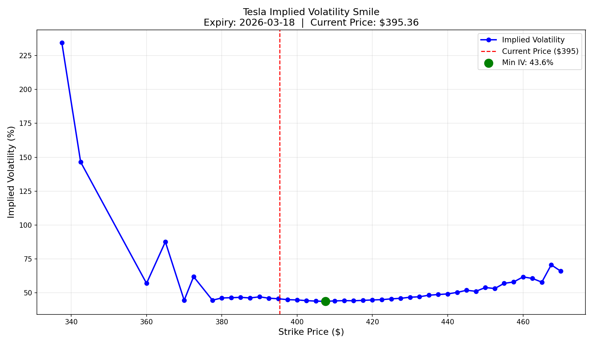

# Black-Scholes Options Pricing & Implied Volatility

Python implementation of the Black-Scholes-Merton model applied to live
Tesla (TSLA) options data. Prices European calls and puts, back-solves
for implied volatility using Brent's method, and visualises the
resulting volatility smile.



## What It Does

1. Implements BSM from scratch — no pricing libraries
2. Verifies correctness via put-call parity
3. Fetches live TSLA option chain data via `yfinance`
4. Inverts the model numerically to extract implied volatility per strike
5. Plots the IV smile and analyses the skew structure

## The Model
C = S·N(d₁) - K·e^(-rT)·N(d₂)
d₁ = [ln(S/K) + (r + σ²/2)T] / σ√T
d₂ = d₁ - σ√T
S = spot price  |  K = strike  |  T = time to expiry (years)
r = risk-free rate  |  σ = volatility  |  N(·) = cumulative normal CDF

## Key Findings (TSLA, fetched ~April 2025)

- ATM implied volatility: ~43.6% at spot ≈ $395
- Pronounced left skew — deep OTM puts carry IV of 200%+
- The skew reflects asymmetric tail-risk pricing: markets price
  a sharp downside move far more heavily than an equivalent rally
- Confirms BSM's constant-volatility assumption breaks down in
  practice — the smile itself is evidence of model misspecification

## Limitations & Extensions

BSM assumes constant volatility and log-normal returns — both
violated empirically. The volatility smile is a direct consequence
of this. Natural extensions include:

- **Stochastic volatility**: Heston model allows σ to follow its
  own mean-reverting process, producing a more realistic smile
- **Local volatility**: Dupire's framework back-solves for a
  deterministic σ(S,t) surface consistent with all market prices
- **Jump diffusion**: Merton's jump model adds Poisson-distributed
  price jumps, better capturing crash risk priced into OTM puts

## Stack

`numpy` · `scipy` · `matplotlib` · `yfinance`

## Run

```bash
pip install numpy scipy matplotlib yfinance
python black_scholes.py
```
